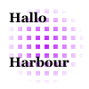

#  hb-cairo

hb-cairo is a **Harbour** module providing bindings for the [Cairo](https://www.cairographics.org/) graphics library. It is a continuation of an old project from 2009 by the author of *Mindaugas Kavaliauskas*. The project has an educational nature - the main goal is to expand knowledge in the field of creating the aplications with the usege of Harbour programing language.

### Getting Started

Installing hb-cairo requires cairo including its headers. For more info see [getting started](docs/tutorial/README.md).

### Example code

``` harbour

#include "hbcairo.ch"

PROCEDURE Main()

   LOCAL hSurface, hCairo, x, y
   LOCAL hPattern

   hSurface := cairo_svg_surface_create( "svg.svg", 500, 500 )
   hCairo := cairo_create( hSurface )

   FOR x = 0 TO 10
      FOR y = 0 TO 10
         cairo_rectangle( hCairo, x * 10.0, y * 10.0, 5, 5 )
      NEXT
   NEXT

   hPattern := cairo_pattern_create_radial( 50, 50, 5, 50, 50, 50 )
   cairo_pattern_add_color_stop_rgb( hPattern, 0, 0.75, 0.15, 0.99 )
   cairo_pattern_add_color_stop_rgb( hPattern, 0.9, 1, 1, 1 )

   cairo_set_source( hCairo, hPattern )
   cairo_fill( hCairo )

   cairo_set_font_size( hCairo, 15 )
   cairo_select_font_face( hCairo, "Georgia", CAIRO_FONT_SLANT_NORMAL, CAIRO_FONT_WEIGHT_BOLD )
   cairo_set_source_rgb( hCairo, 0, 0, 0 )

   cairo_move_to( hCairo, 10, 25 )
   cairo_show_text( hCairo, "Hallo" )

   cairo_move_to( hCairo, 10, 75 )
   cairo_show_text( hCairo, "Harbour" )

   cairo_destroy( hCairo )
   cairo_surface_destroy( hSurface )

   RETURN

```

## The end result


