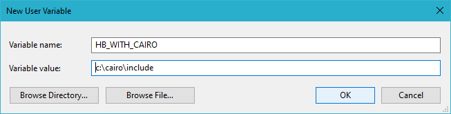
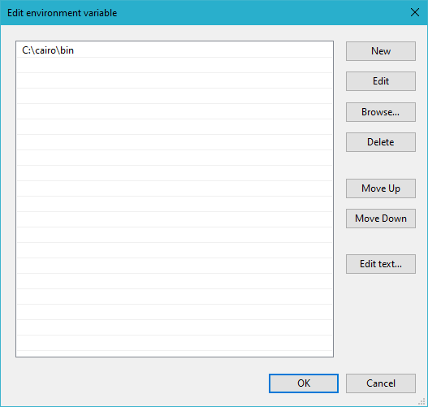

# Getting started

* [Harbour programming language](https://en.wikipedia.org/wiki/Harbour_(programming_language))
* [Homepage](https://harbour.github.io)
* Select your Harbour:
   - [hb30](https://sourceforge.net/projects/harbour-project/files/)
   - [hb32](https://github.com/harbour/core)
   - [hb34](https://github.com/vszakats/harbour-core)

# Install Cairo

###  MSYS2

``` shell

$ pacman -S mingw-w64-x86_64-cairo

```

``` shell

$ export HB_WITH_CAIRO="$usr/mingw64/include"

```

``` shell

$ gcc --version
gcc.exe (Rev5, Built by MSYS2 project) 10.2.0
...

$ cd hb-cairo
$ hbmk2 hbcairo.hbp
hbmk2: Dependency 'cairo' found: C:\msys64\mingw64\include
hbmk2: Created import library: lib\win\mingw64\libcairo.a <=
       C:\msys64\mingw64\bin\libcairo-2.dll
hbmk2: Created import library: lib\win\mingw64\libcairo.a <=
       C:\msys64\mingw64\lib\libcairo.dll.a
hbmk2: Target up to date: lib\win\mingw64\libhbcairo.a

```

###  MinGW-w64

Download binaries **Cairo** from this project and install:

``` shell

c:\cairo\bin
c:\cairo\include
c:\cairo\lib

```

Install the rest of the missing libraries in mingw-w64

``` shell

c:\>mingw-w64

```

Click New to create a new environment variable. Click Edit to modify an existing environment variable.



After creating or modifying the environment variable, click OK to have the change take effect.

The Edit environment variable UI will appear. Here, you can click New and type in the new path you want to add. From this screen you can also edit or reorder them.



> Note: The graphical user interface for creating environment variables may vary slightly, depending on your version of Windows.

For the record:

``` shell

c:\>set HB_WITH_CAIRO=C:\cairo\include
c:\>set PATH=C:\cairo\bin;%PATH%

```
``` shell

c:\>gcc --version
gcc (x86_64-posix-seh-rev0, Built by MinGW-W64 project) 8.1.0
...

c:\>cd hb-cairo
c:\hb-cairo>hbmk2 hbcairo.hbp
hbmk2: Dependency 'cairo' found: c:\cairo\include
hbmk2: Created import library: lib\win\mingw64\libcairo.a <=
       c:\cairo\bin\libcairo-2.dll
hbmk2: Created import library: lib\win\mingw64\libcairo.a <=
       c:\cairo\lib\libcairo.dll.a
hbmk2: Target up to date: lib\win\mingw64\libhbcairo.a

```

##

[Edit me](https://github.com/rjopek/hb-cairo/edit/main/docs/tutorial/README.md)
